# Client Bot – iShareNodes

The **Client Bot** in iShareNodes is the main interface through which users interact with the platform. This bot handles all front-facing operations such as user registration, contribution commands, status checks, and notifications. It runs entirely on Discord, providing a seamless and familiar experience for participants.

---

## 🧑‍💻 1. User Registration

Account creation begins in the `#create_account` Discord channel, where users interact through **Discord modals** (popup input forms). This eliminates the need for traditional commands and improves usability, especially on mobile.

Once a user submits their email via the modal, the input is passed to the **Master Bot**, which handles:

- Generating a secure, time-based token (TOTP)
- Sending the token to the user's email
- Verifying the token when the user submits it back
- Creating and storing the user profile

This modular handoff between the **Client Bot** (UI/interaction) and the **Master Bot** (logic/database) ensures a clean separation of responsibilities while keeping the client side lightweight and responsive.

### Screenshots

  
  
  

### Screenshots

  
  
  

---
## 💼 2. Deposits, Withdrawals 

All operations in the client interface are fully interaction-based and presented as **ephemeral messages** — responses that are only visible to the requester. This makes it possible to use a **shared public channel** for all interactions without exposing private user data.

---

### 🔁 Deposits

Users initiate deposits using interactive buttons. Upon interaction:
- A **modal** appears for users to enter the amount.
- A **selection box** (dropdown) is presented to choose a cryptocurrency.
- Once submitted, the request is passed to the **Master Bot**, which verifies input and updates the user’s wallet.

> If the number of supported coins exceeds Discord’s selection box limit, a **pagination system** dynamically loads the next batch of coin options, ensuring a smooth and complete experience.

  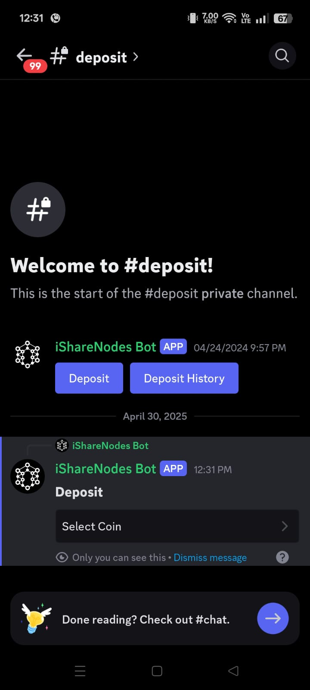
  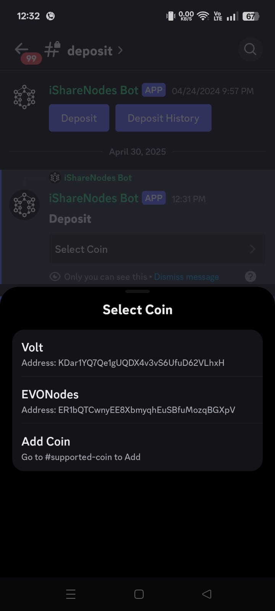
  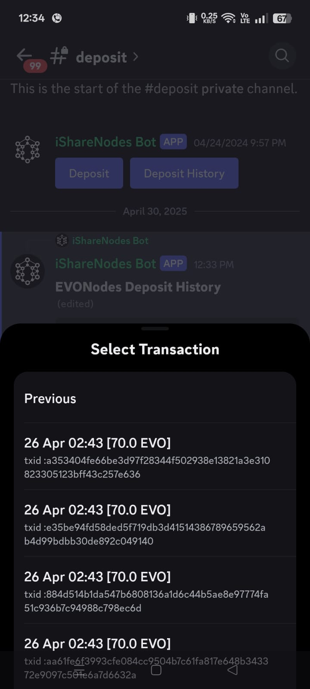
  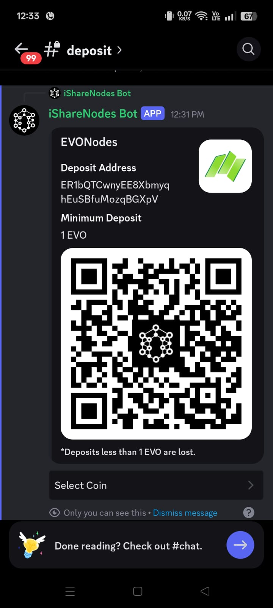
  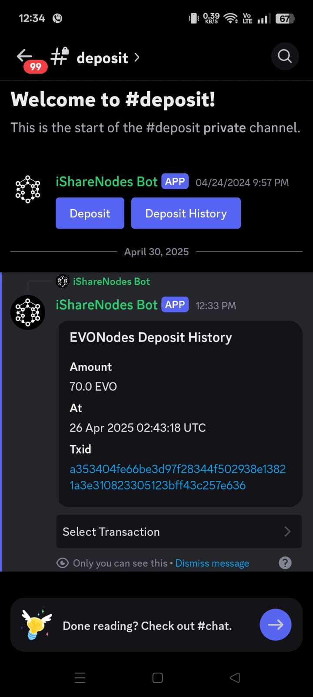
  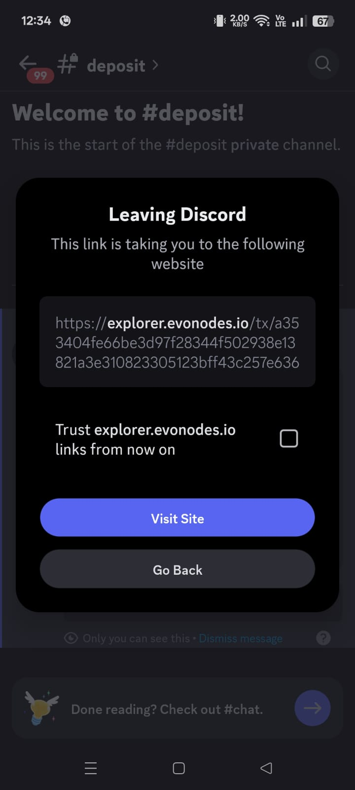

---

### 💸 Withdrawals

Withdrawals follow a similar interaction pattern:
- Users select the coin and amount via modals.
- Confirmations are shown via ephemeral messages.
- The **Master Bot** processes the withdrawal, deducts balance, and forwards the request to the **Wallet Bot** for actual transaction handling.

All confirmations and status updates are sent as ephemeral messages, maintaining user privacy.

    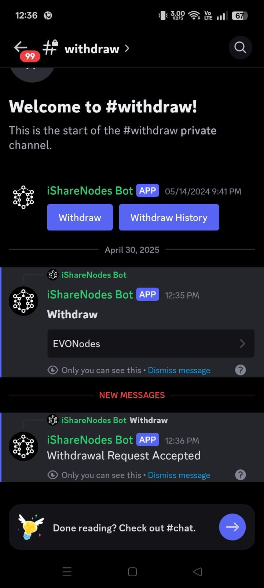
  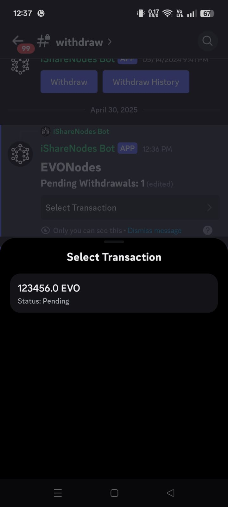
  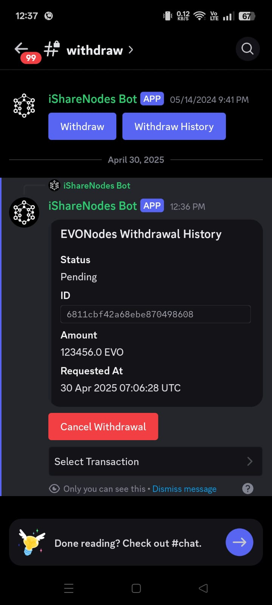
  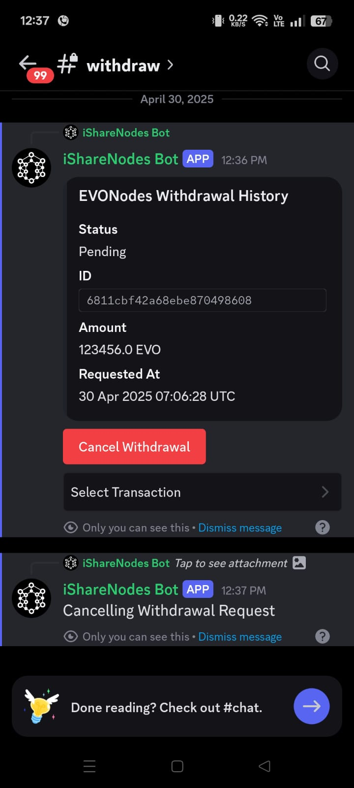
  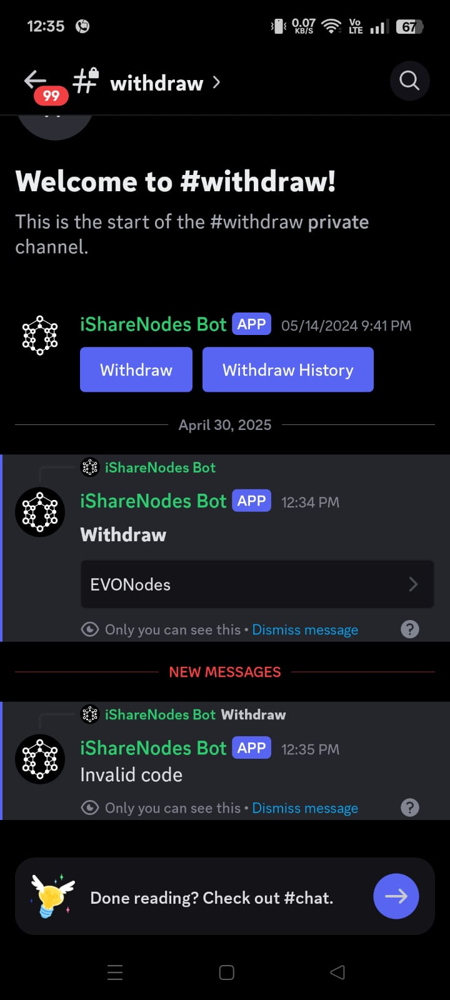
  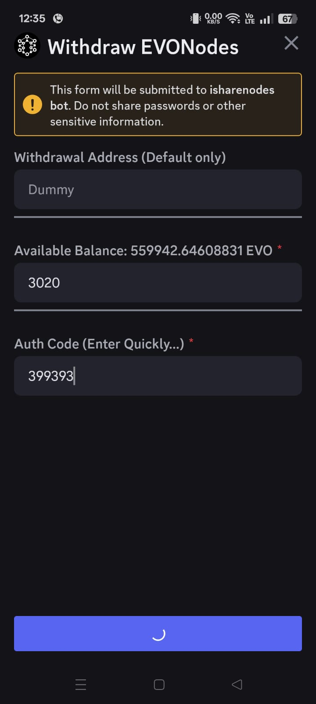

---

## 📊 3. Portfolio Status, Rewards & Masternode Allocation

This section gives users a comprehensive view of their holdings, earnings, and how their funds are allocated within the shared masternode network.

All user interactions are handled via **ephemeral messages** in public channels, ensuring privacy without sacrificing a seamless UI experience.

---

### 💼 Portfolio Overview

Users can view their crypto portfolio using a simple interaction button. The data shown includes:
- Total deposits (coin-wise)
- Withdrawable balance
- Pending transactions
- Daily rewards

All relevant data is fetched from a local **MongoDB** instance.

  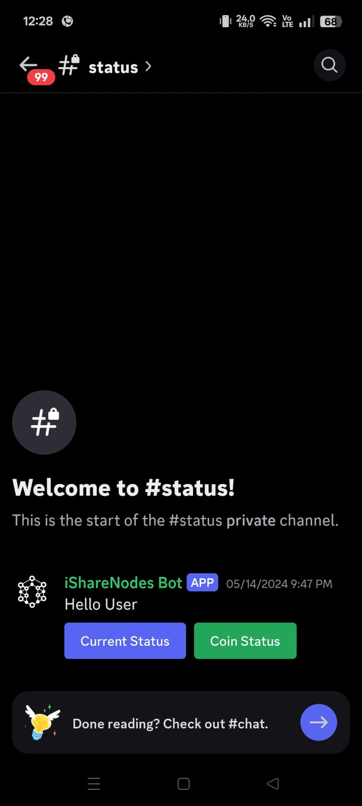
  
  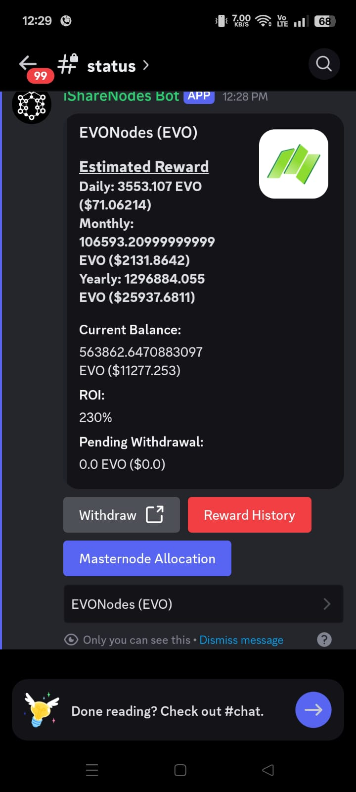

---

### 🎁 Daily Rewards Tracking

Rewards are distributed on a daily basis by the **Wallet Bot**, and users can view:
- A timeline of daily reward summaries
- Merged reward data grouped by coin and day
- Individual node earnings

> Efficient **timestamp-based sorting** and **merging algorithms** are used to group rewards into clean daily reports. This makes it easier for users to track performance over time.

  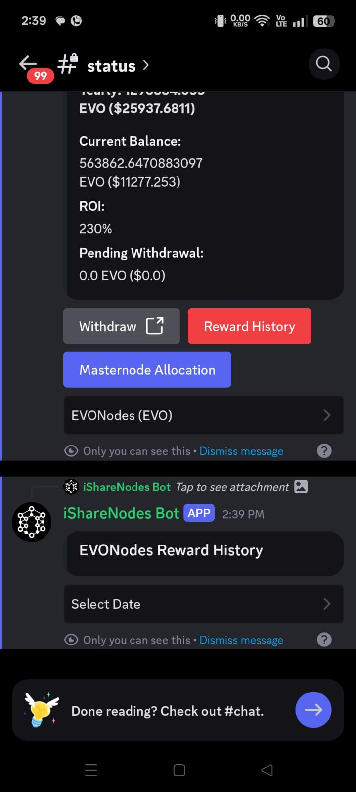
  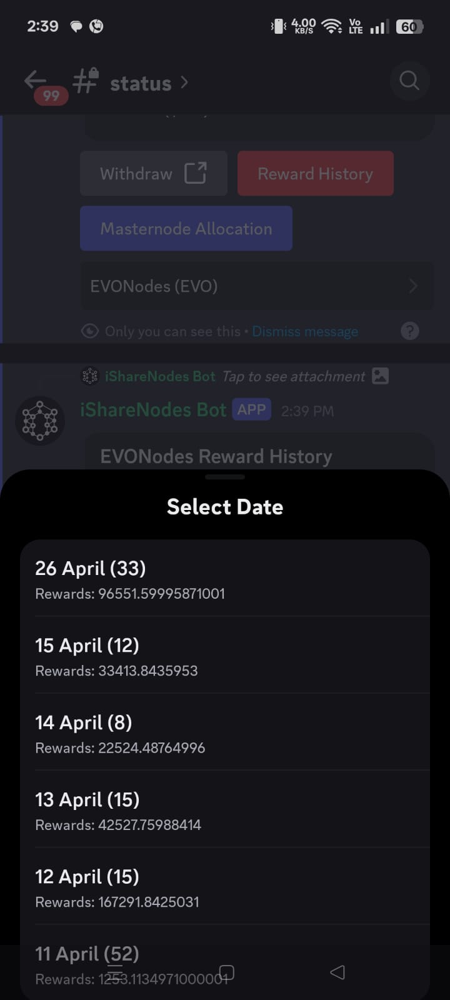
  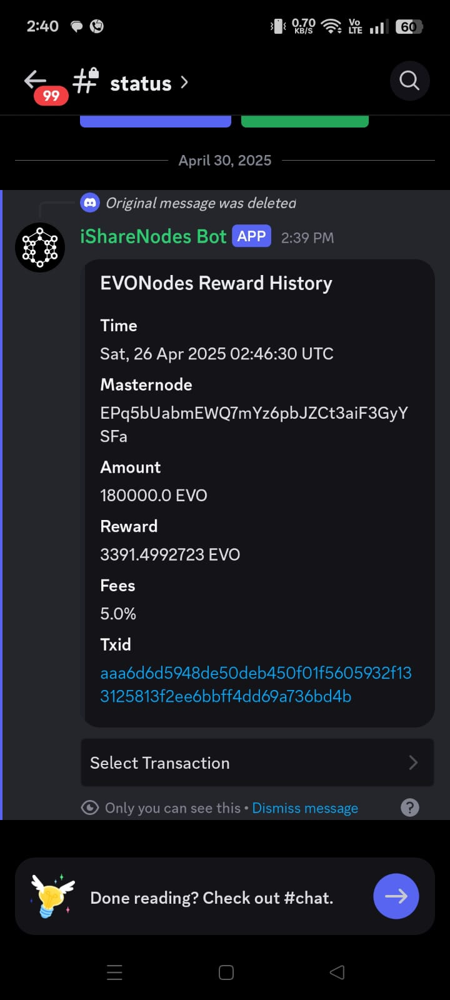
  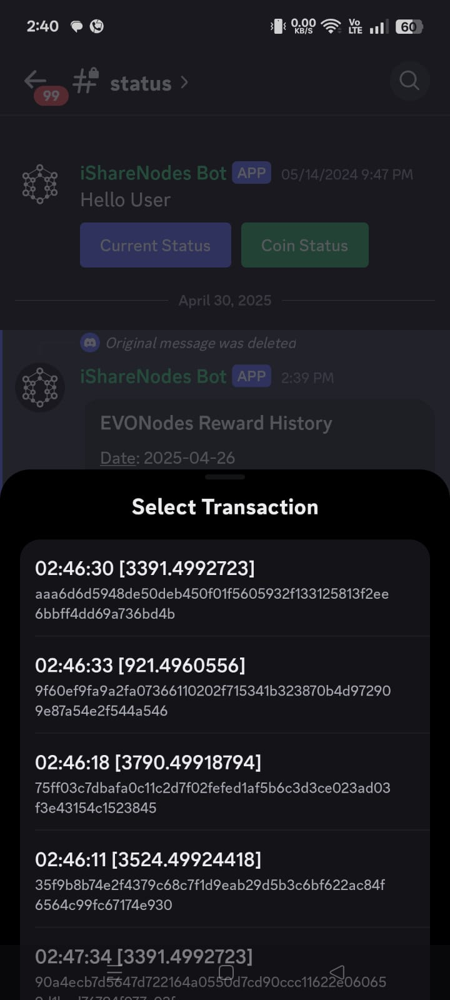
  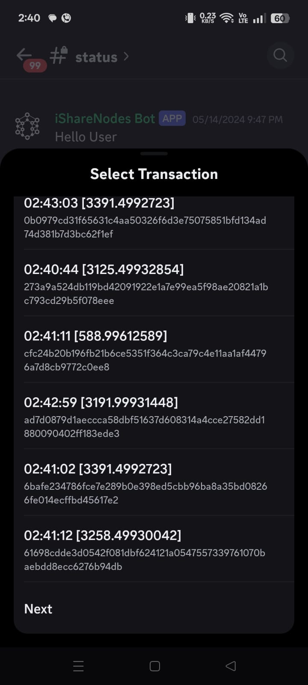

---
### 🧩 Masternode Allocation

Users can click a dedicated button to access a detailed breakdown of how their funds are distributed across active masternodes. This provides transparency and real-time insight into:

- Coin-wise and node-wise allocation percentages
- User's share in each masternode
- Estimated reward share per node
- Current status of each node (active/inactive)

The interface is rendered using **Discord embeds** or **paginated buttons**, allowing smooth scrolling and visibility across mobile and desktop devices.

  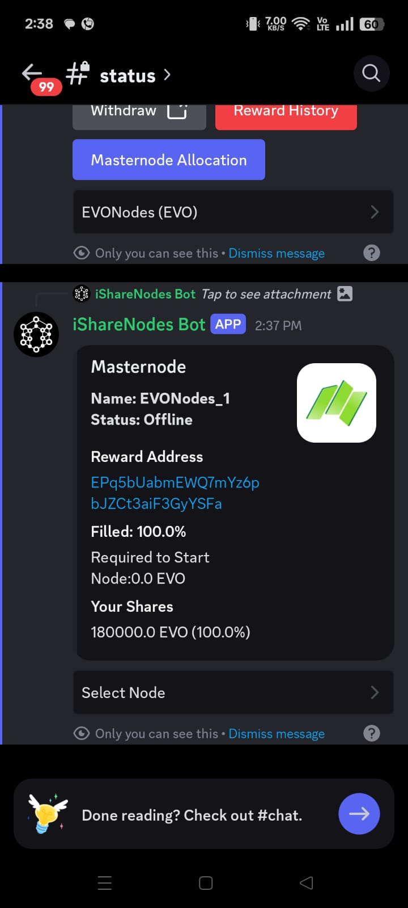
  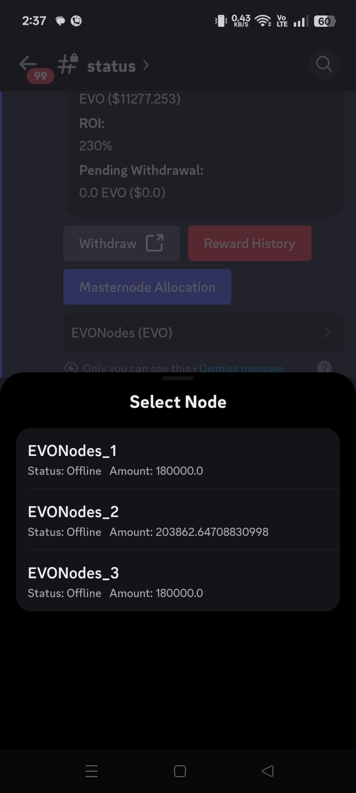

---

The data is managed and served by the **Wallet Bot**, which:
- Fairly allocates user deposits across available masternodes
- Ensures that all participants receive **equal opportunity** in rewards and allocations
- Embeds these allocation summaries directly in the daily reward reports

To keep performance optimal, allocation data is also supported by the **Master Bot** for fast retrieval and formatting.

---

> Behind the scenes, **data structures and algorithms (DSA)** such as sorted lists and timestamp-based maps are used to:
- Track contributions over time
- Sort deposits and rewards by date
- Merge daily rewards for efficient analytics and clean summaries

This backend design offloads heavy computation from the Client Bot, ensuring that all interactions remain fast, responsive, and privacy-focused via ephemeral messages.

---

## 🛠️ 4. Support Options

The support section is designed to provide quick and organized assistance — directly within Discord. There are no external links, emails, or redirections involved. All actions are done via interactions and modals to keep the process intuitive and responsive.

---

### 📥 Report Missing Deposit

Users can report if a deposit hasn’t reflected in their account. Upon clicking the relevant button:
- A modal is presented to enter transaction ID, coin, and date.
- The request is sent to the **Master Bot** for verification.
- Updates or resolutions are sent as ephemeral messages.

#### Screenshots

  
  
  

---

### 🔐 Change Withdrawal Address

Users can securely update their withdrawal address through a modal form. This includes:
- Input validation of address format
- Notification of change history
- Confirmation prompt before submission

#### Screenshots

  
  
  

---

### 🧾 Contact Support (Ticket System)

Unlike traditional email support, iShareNodes uses a **Discord-native ticket system** for seamless, real-time issue tracking.

#### How It Works:
- A modal is presented to collect the **subject** and **message**.
- Upon submission, the **Client Bot** auto-generates a **private channel** and starts a **thread** to handle the ticket.
- All communication between the user and the support team takes place within this thread.
- This design prevents multiple queries from being mixed together and provides a clean history of communication.

#### Extra Features:
- Users can **close** or **reopen** their ticket at will.
- They are **notified** when the support team responds inside the thread.

#### Screenshots

  
  
  

---

> All screenshots were taken from a mobile device and resized using width attributes for clarity. Keep the original large images in the `./screenshots/` folder for full resolution reference.

---

### 📄 License
This document is for informational purposes only. Source code is private.

